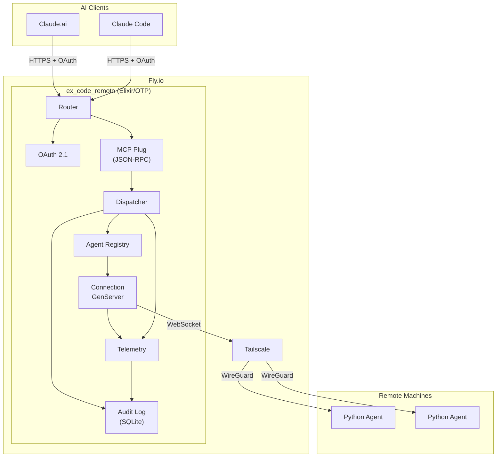
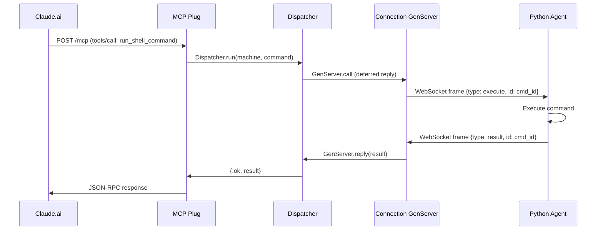
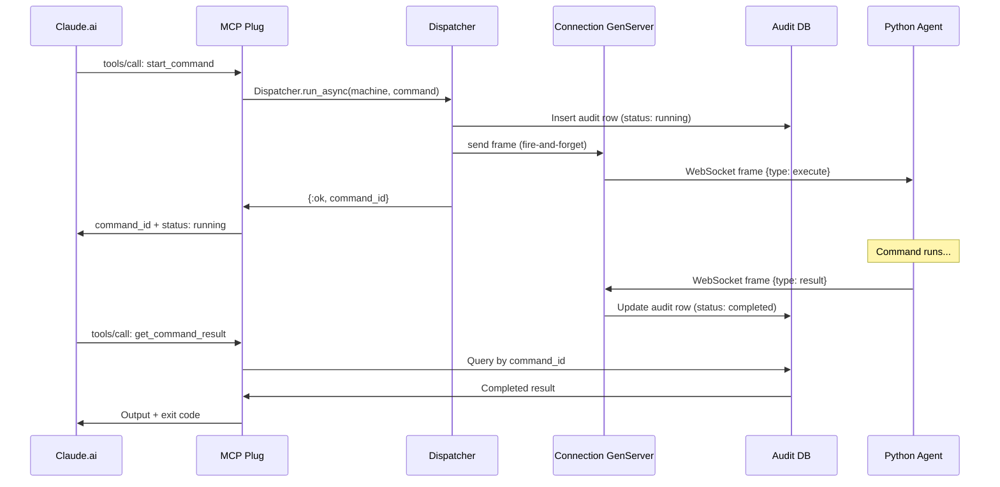

# ex_code_remote

Elixir server for remote code execution via [MCP](https://modelcontextprotocol.io/) (Model Context Protocol). Replaces the original Python `code-remote` server with BEAM-native supervision, in-memory command correlation, and structured observability.

A Python agent runs on each remote machine and connects via WebSocket. AI clients (Claude.ai, Claude Code) connect via MCP over HTTP and dispatch shell commands, file operations, and directory listings to the agents.

## Architecture



### Synchronous command flow



### Async command flow



### Key design decisions

- **One GenServer per agent connection** -- crash isolation, no shared mutable state between agents
- **In-memory command correlation** -- deferred `GenServer.reply` replaces the Python server's SQLite polling loop
- **Async command path** -- long-running commands (builds, test suites) dispatch asynchronously and store results in the audit DB; clients poll with `get_command_result`
- **Tailscale network enforcement** -- agent WebSocket connections are restricted to Tailscale CGNAT IPs (`100.64.0.0/10`), so a leaked auth token alone can't register rogue agents
- **OAuth 2.1 for MCP** -- Claude.ai authenticates via Authorization Code + PKCE; the server auto-approves (single user)

## MCP Tools

| Tool | Description |
|------|-------------|
| `run_shell_command` | Synchronous shell execution (capped at 50s by Fly's proxy) |
| `read_file` | Read file contents from a remote machine |
| `write_file` | Write content to a file on a remote machine |
| `list_directory` | List directory contents |
| `check_agent_status` | List connected agent machine names |
| `start_command` | Async shell execution -- returns a `command_id` immediately (up to 1h timeout) |
| `get_command_result` | Look up async command status/result by id, with optional blocking wait |
| `list_commands` | Browse recent commands with machine/status/time filters |

## Development

### Prerequisites

- Elixir 1.19+ / OTP 28+ (pinned in `mise.toml`)
- SQLite3 (for the audit log)

### Setup

```sh
mix deps.get
mix ecto.create
mix ecto.migrate
```

### Running

```sh
AUTH_TOKEN=dev-token mix run --no-halt
```

The server starts on `http://localhost:4000`. In dev, private network enforcement and MCP OAuth are disabled.

### Testing

```sh
mix test
```

## Deployment (Fly.io)

### First deploy

```sh
# Copy and customize the Fly config
cp fly.toml.example fly.toml
# Edit fly.toml: set your app name and preferred region

# Create app and volume
fly apps create your-app-name
fly volumes create ex_code_remote_data --region YOUR_REGION --size 1 -a your-app-name --yes

# Set secrets
fly secrets set AUTH_TOKEN=$(openssl rand -hex 32) -a your-app-name
fly secrets set TAILSCALE_AUTHKEY=tskey-auth-... -a your-app-name
fly secrets set MCP_CLIENT_ID=your-client-id -a your-app-name
fly secrets set MCP_CLIENT_SECRET=$(openssl rand -hex 32) -a your-app-name

# Deploy
fly deploy
```

### Environment variables

| Variable | Required | Default | Description |
|----------|----------|---------|-------------|
| `AUTH_TOKEN` | Yes (prod) | -- | Shared secret for agent WebSocket auth and `/commands` endpoint |
| `PORT` | No | 8080 (Docker) / 4000 (dev) | HTTP listen port |
| `DATABASE_PATH` | No | `/data/audit.db` | SQLite audit database path |
| `TAILSCALE_AUTHKEY` | No | -- | Tailscale auth key; skips Tailscale if unset |
| `REQUIRE_PRIVATE_NETWORK` | No | `true` (prod) | Enforce Tailscale IP check on `/ws/agent` |
| `MCP_CLIENT_ID` | No | -- | OAuth client ID for MCP auth; MCP is open if unset |
| `MCP_CLIENT_SECRET` | No | -- | OAuth client secret for MCP auth |

### Connecting Claude.ai

Add a custom MCP connector in Claude.ai settings:

- **URL**: `https://your-app-name.fly.dev/mcp`
- **OAuth Client ID**: value of `MCP_CLIENT_ID`
- **OAuth Client Secret**: value of `MCP_CLIENT_SECRET`

## Agent setup

The Python agent runs on each machine you want to control remotely. It connects to the server via WebSocket and executes commands.

### Quick start

```sh
cd agent
./setup.sh
```

The setup script installs dependencies (via `uv`), prompts for your server URL, auth token, and machine name, and writes a `.env` file.

### Running manually

```sh
cd agent
./run.sh
```

### Running as a macOS service (launchd)

For persistent background operation that survives reboots:

1. Edit `agent/com.code.remote-agent.plist` -- replace `YOUR_USERNAME` and the path to match your system
2. Copy to LaunchAgents and load:

```sh
cp agent/com.code.remote-agent.plist ~/Library/LaunchAgents/
launchctl load ~/Library/LaunchAgents/com.code.remote-agent.plist
```

To stop: `launchctl unload ~/Library/LaunchAgents/com.code.remote-agent.plist`

### Running in Docker (sandboxed)

```sh
cd agent
docker build -t code-remote-agent .
docker run -d \
  -e RELAY_URL=ws://100.x.x.x:8080/ws/agent \
  -e AUTH_TOKEN=your-token \
  -e MACHINE_NAME=my-docker-agent \
  code-remote-agent
```

### Agent environment variables

| Variable | Required | Description |
|----------|----------|-------------|
| `RELAY_URL` | Yes | WebSocket URL to the server (`ws://` for Tailscale, `wss://` for public) |
| `AUTH_TOKEN` | Yes | Must match the server's `AUTH_TOKEN` |
| `MACHINE_NAME` | Yes | Unique name for this machine (shown in `check_agent_status`) |

## Project structure

```
agent/                 # Python agent (runs on remote machines)
  agent.py             # WebSocket client, command execution
  setup.sh             # Interactive installer
  run.sh               # Launcher with log rotation
  Dockerfile           # Sandboxed Linux container option
  com.code.remote-agent.plist  # macOS launchd service template
lib/
  ex_code_remote/
    agent/             # WebSocket handler, connection GenServer, registry
    audit/             # Ecto schema, repo, query layer
    commands/          # Dispatcher, codec, async subscribers, startup sweeper
    mcp/               # JSON-RPC plug, tool definitions, result formatter
    plugs/             # RequestTiming, PrivateNetwork
    telemetry/         # Event handler, metric definitions
    application.ex     # Supervision tree
    oauth.ex           # OAuth 2.1 (authorization code + PKCE)
    release.ex         # Mix release tasks (migrate)
    router.ex          # Plug.Router (health, ws, commands, oauth, mcp)
config/                # Dev, test, prod, runtime config
priv/audit/migrations/ # SQLite migrations
rel/entrypoint.sh      # Docker entrypoint (Tailscale + migrate + start)
specs/                 # Design specifications (SPEC-1 through SPEC-10)
```
